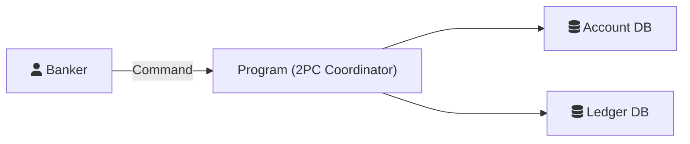
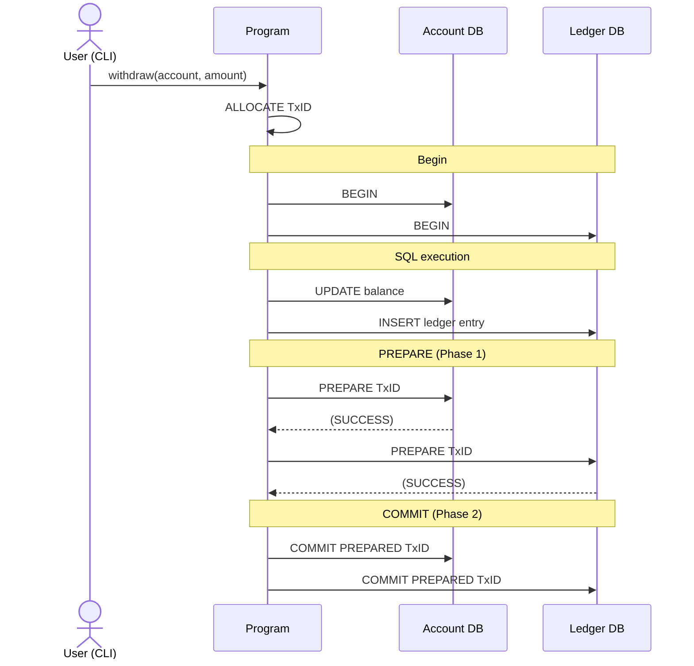
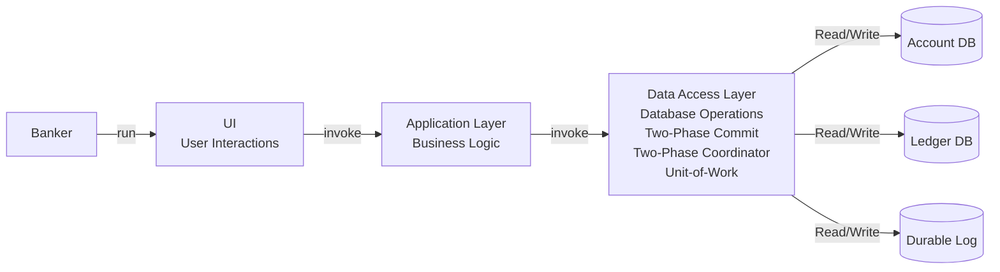
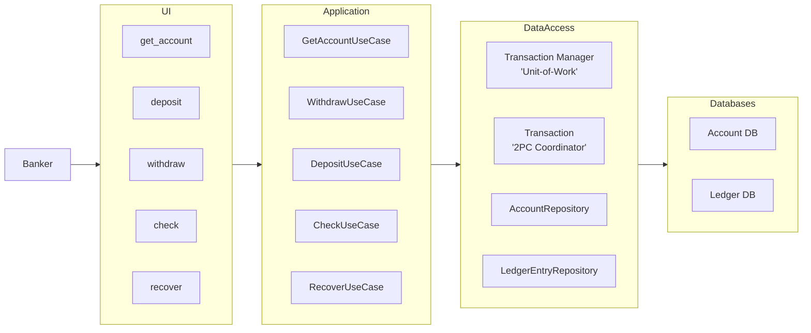
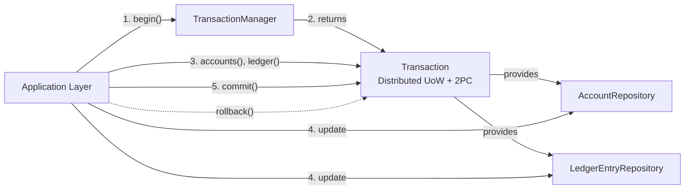
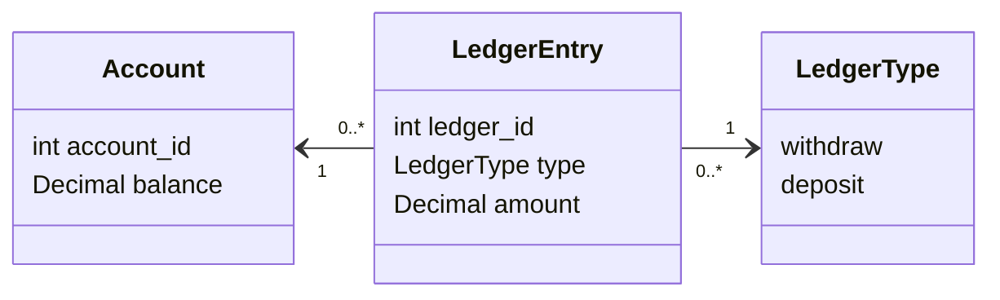

# Design for Consistent Finance: A Case Study of the Two-Phase Commit Protocol

## Introduction

Consistent Finance is a command-line (CLI) program designed to demonstrate how the Two-Phase Commit (2PC) protocol preserves data consistency across distributed database instances. The project also explores the advantages and limitations of 2PC in failure scenarios.

The project aims to implement:

1. A Two-Phase Commit coordinator integrated into the program responsible for managing distributed transactions across multiple database instances.
2. A simple financial domain model (accounts and ledger entries) to exercise multi-step read/write transactions spanning two tables located on separate database instances.
3. A failure simulation and recovery mechanism to demonstrate system behavior under database outages and network disruptions.

## Terms

**Account**

A financial account in the system tracks each user's balance.

**Ledger Entry**

An immutable accounting record representing a change in an account’s balance.

- **DEPOSIT**: A positive ledger entry that increases the associated account balance;
- **WITHDRAW**: A negative ledger entry that decreases the associated account balance.

**Transaction**

A unit of work executed atomically within a database system.

**Banker**

The imagined banker who works with a text terminal.

**Presenter**

A team member of the project who demonstrates the project outcome to the class.

## Functional Requirements

The purpose of the program is to demonstrate how the Two-Phase Commit protocol preserves data consistency across distributed database instances.

1. The banker can retrieve an account's information, including the balance, by issuing a command with an account number;
2. The banker can deposit a specified amount into a specified account;
3. The banker can withdraw a specified amount from a specified account;
4. All deposit and withdrawal operations must be executed as distributed transactions involving both the Account DB and Ledger DB.

## Data Consistency

For every account, the sum of all ledger entries must equal the stored account balance

## Non-Functional Requirements

1. If one participant database becomes unavailable during a distributed transaction, the transaction must be aborted and the system must not violate the consistency invariant. 
2. If the database containing the ledger entries fails, the system should downgrade service level to read-only, which only supports retrieving account information;
3. If a failed database comes back online, the system should be able to resolve any pending transactions and restore a consistent state;

## Demonstration Requirements

1. The presenter should be able to pause an on-going transaction to execute simulations such as shutting down a database instance to simulate an unexpected disruption;
2. The presenter should be able to show the transactions and their internal state (PREPARE, COMMIT, ABORT) for demonstration purposes;
3. The presenter should be able to run a recovery program after bringing the database instances back online and restore the database to a consistent state;
4. The presenter should be able to verify the data consistency.

## Architecture

### Design Goals and Scope

The system is designed to demonstrate how a Two-Phase Commit coordinator enforces atomicity and preserves the defined data consistency invariant across multiple PostgreSQL instances. The architecture prioritizes correctness, observability of transaction states, and deterministic recovery after crash-stop failures. High availability, performance optimization, sharding, and production-grade concurrency control are explicitly outside the scope of this project.

### Two-Phase Commit Protocol Overview

The following diagram describes a _Happy Path_ of a distributed transaction.

Before sending PREPARE or COMMIT decisions, the coordinator persists the corresponding state transition in its durable log to ensure recovery safety.

### System Overview 

- UI parses CLI commands and prints results.
- Application layer implements use-cases (withdraw/deposit/query) and calls the persistence boundary.
- Data Access layer provides a Unit-of-Work (TransactionManager) that coordinates repositories and runs 2PC to commit across both databases.
- Durable log enables deterministic recovery via `  recovery.py`.

### Components

### Data Access Layer Design

The application layer never coordinates participants directly. It operates on repositories within a Transaction scope and finalizes via commit() or rollback().

### Domain Entities

